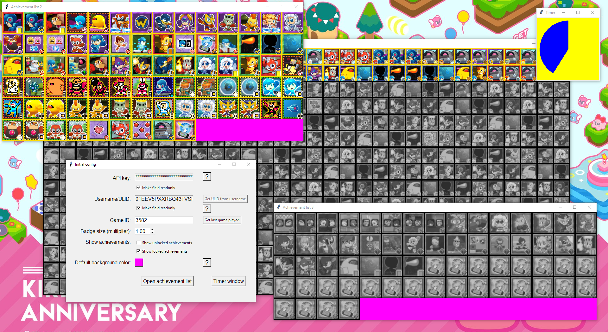
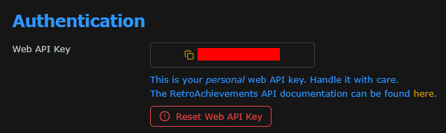
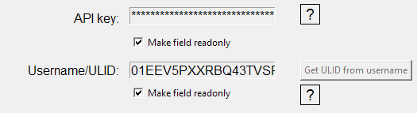
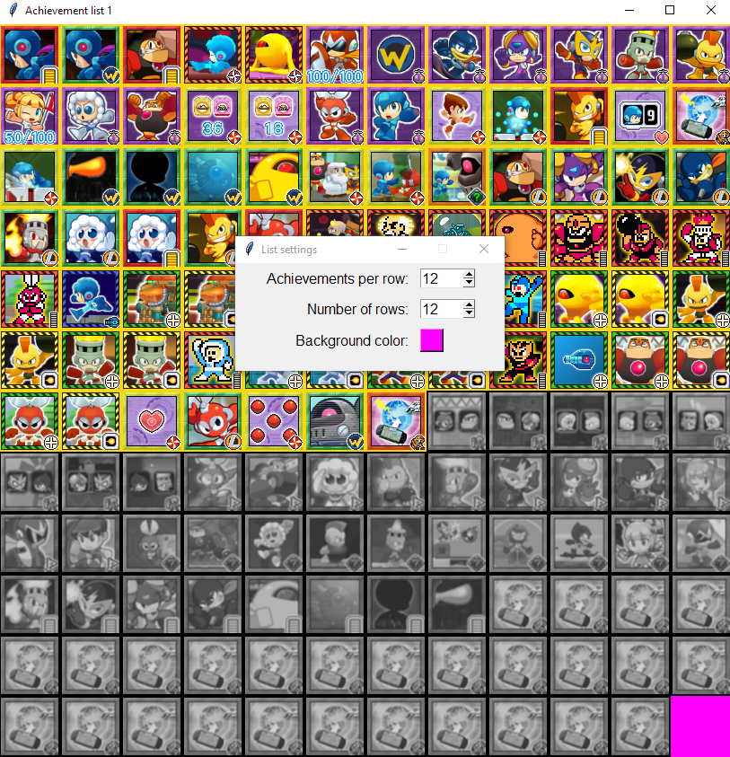
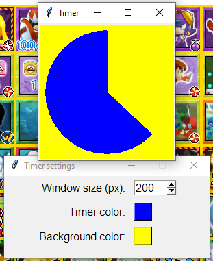
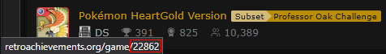

# RA achievement list



This is basically a copy of [RA Tracker](https://github.com/colossus-gaming/retroachievements-layout-manager)'s achievement list, but with some differences.

Initially, I made it to be able to change the window's size, without realizing I just had an old version of RA Tracker that didn't have it yet =D

This was mostly for personal use, but I ended up trying to make it a bit more user friendly, and added some stuff as well.


I don't plan on adding any other functionality from RA Tracker; what they do is already good enough in my opinion, and my plan isn't to become a full copy of them.

## Changes
- Can open more than one list; this can be useful for multisets
- Decrease badge size up to half the original; if for some reason you want to see all 1000 achievements at once, it's possible
- Show only locked or only unlocked achievements; useful when you want to put them in different places in your layout

- Doesn't have any kind of animation
- Doesn't have any kind of autoscroll (and scrolling is only possible if hovering over an area without badges)

## Compiling
I made and tested this code with Python 3.14.3, Windows 10.

You can just run main.py to run the code:
```
py main.py
```

I created the .exe file with pyinstaller:
```
pyinstaller --onefile --noconsole main.py
```

## How to use
First of all, leave the executable in a folder with read/write permissions. It will attempt to create a config.ini file and a "badges" folder, where it'll save the badge images.

Follow the instruction to get the web API key, and put the username. Use the checkmarks below them to make them uneditable, so you can't change them by mistake later.



The program will hide the key, but it's saved in plain text in config.ini; so if you open that file and stream it by mistake, I'd suggest resetting it for a new key.

Get the ULID if you want.



Choose your options for the list, then open the achievement list.

When opened, you can right click on the window to open a setting window; you can use it to set the exact amount of achievements per row/column.



The timer is a visual indicator to show when the next update will happen. Possible to edit colors and size. It won't run when there's no list open.



The size and position of the achievement lists and timer are saved, so the next list you open, it'll keep them.

Also, if you close the initial window dirently, all windows will close together; then, the next time you open it, all achievement windows will reopen as well.

Refresh timer is set to 30 seconds. I'm a bit reluctant to let this be editable. People like to see changes as close to real time as possible, but pulling requests too often for updates that usually comes every few minutes is pretty wasteful.

## Known issues
- This is meant to be used for 1 user only; if you open an achievement list and change the username/ULID, the program will start to update for that new user while keeping the old user's list. I don't have any plans to change that.
- Right now the API documentation don't mention any way to get a subset list from their subset ID, so you need to use their game ID. The easiest way is to hover over a subset link and see their URL with the game ID.



- Sometimes the total badge count is wrong when downloading badges. That's because I just take the amount of achievements and multiply by 2, but there are some achievements that use the same exact badge, and so the downloading will finish before it gets to the total count.
- You can't cancel the badge downloading in the middle (unless you force-kill it, of course), so it may take a while to download large sets (it downloads 2 images per achievement).
- If an achievement receives a new badge, the program won't check for that. To force redownloading badge images, delete its folder inside the "badges" folder.
- This was designed with hardcore in mind; it will probably fail to work with softcore in most places. I might change that later.
- Maximizing a resizable window will make its settings act a bit wrong; it'll show the correct size, but won't be able to change them until you restore the window.
